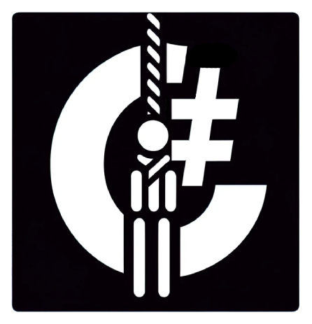

<!-- 
	Shields
-->
[![Downloads][downloads-shield]][downloads-url]

[downloads-shield]: https://img.shields.io/github/downloads/Kordeyrow/UnityStudy-HangmanGameConsole/total?logo=GitHub
[downloads-url]: https://github.com/Kordeyrow/UnityStudy-HangmanGameConsole/graphs/contributors

<!-- 
	Logo
-->

  

  <h3 align="center">Hangman Game Console</h3>

  

    A console game to study game programming with C#
  

<!-- 
	Game flow Diagram
-->

## GameFlow / GameComponents Diagrams

### Extra Feature: Reading data from Google Sheets

### User Settings:

